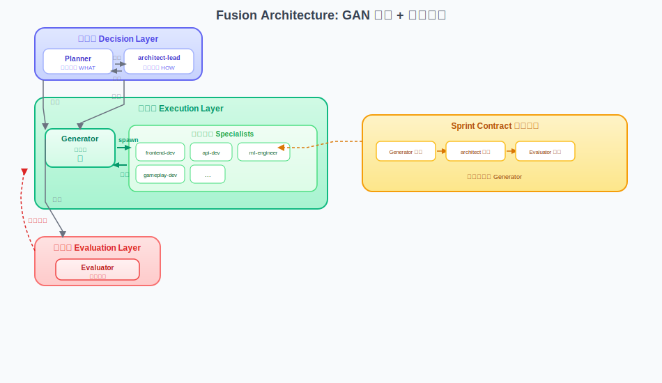

# Harness Creator

[English](README.md) | 中文

> 一键生成定制化 Claude Code harness 框架，融合架构：GAN 启发的多智能体系统 + 领域专家

[](LICENSE)
[](https://claude.ai)

---

## 什么是 Harness Creator？

Harness Creator 是一个元框架，用于生成定制化的 `.claude/` harness 结构，实现 AI 辅助开发。它基于 Anthropic 的最佳实践，采用增强的融合架构。

### 核心特性

- **融合架构**：GAN 启发的核心 + 领域专家系统
- **一键生成**：自动检测项目类型和领域
- **领域模板**：预定义的 Web、游戏、数据科学等模板
- **动态生成**：支持任意新领域
- **Sprint Contract**：实现前协商"完成"标准
- **Context Reset**：长时间任务的结构化交接

---



### 三层分工

| 层级 | Agent | 职责 |
|------|-------|------|
| **决策层** | Planner, architect-lead | 产品和架构决策 |
| **执行层** | Generator, [domain]-dev | 实现功能 |
| **评估层** | Evaluator | 测试和评分 |

### 为什么需要分离？

模型无法可靠地评估自己的工作：

- 把平庸输出称为"完成"
- 跳过边缘情况和错误处理
- 遗漏集成问题
- 接受不完整的解决方案

**解决方案**：分离生成和评估，委托给专家。

---

## 快速开始

### 安装

```bash
npx skills add https://github.com/fanlw0816/harness-creator --skill harness-creator
```

### 使用

```
/harness-creator [目标目录]
```

### 示例会话

```
> /harness-creator ./my-game

## 项目分析

**路径:** ./my-game
**类型:** Game Development (Unity)

## 推荐配置

核心 Agents:
  Planner        - 产品规划
  Generator      - 协调执行
  Evaluator      - 评估实现
  architect-lead - 架构决策

Specialists:
  [√] gameplay-dev    游戏逻辑、机制、AI
  [√] graphics-dev    渲染、shader、特效
  [√] audio-dev       音效、音乐系统
  [√] ui-dev          游戏UI、HUD、菜单

选项:
  A) 使用推荐
  B) 调整选择
  C) 添加自定义 specialist

> A

Harness 已生成至 ./my-game/.claude/
```

---

## 领域模板

### 支持的领域

| 领域 | Specialists |
|------|-------------|
| **Web Development** | frontend-dev, api-dev, database-dev, devops-dev |
| **Game Development** | gameplay-dev, graphics-dev, audio-dev, ui-dev |
| **Data Science** | data-engineer, ml-engineer, data-analyst |
| **Mobile App** | ios-dev, android-dev, backend-dev |
| **自定义** | 根据项目结构动态生成 |

### 模板结构

```
domain-templates/
├── web-development/
│   ├── template.yaml
│   └── specialists/
│       ├── frontend-dev.yaml
│       └── api-dev.yaml
├── game-development/
│   └── ...
└── _dynamic/                    # 动态生成
    ├── specialist-template.yaml
    └── detection-rules.yaml
```

### 添加新领域

1. 创建模板目录：`domain-templates/your-domain/`
2. 定义 `template.yaml` 和检测规则
3. 在 `specialists/*.yaml` 中添加专家定义

---

## Sprint Contract

### Contract 生命周期

```
1. PROPOSE     Generator 提议 contract（包含 specialist 分配）
      |
      v
2. REVIEW      architect-lead 审核架构
      |         Evaluator 审核可测试性
      v
3. NEGOTIATE   往返协商直到达成一致
      |
      v
4. APPROVE     所有方签字确认
      |
      v
5. IMPLEMENT   Generator 协调 specialists
      |
      v
6. EVALUATE    Evaluator 按 contract 评分
      |
      v
7. ITERATE     FAIL → 修复问题，重新评估
```

### Contract 结构

```markdown
# Sprint Contract: [功能名称]

## Scope
- What, In Scope, Out of Scope

## Architecture Decision
- Specialists Involved
- Cross-Domain Boundaries

## Testable Behaviors
- [ ] B1.1: [行为] | Owner: [specialist]

## Acceptance Criteria
| ID | Criterion | Pass | Fail | Priority | Owner |

## Responsibility Matrix
| Criterion | Responsible | Fallback |
```

---

## 生成的 Harness 结构

```
<target-dir>/
├── .claude/
│   ├── settings.json
│   ├── agents/
│   │   ├── planner.md
│   │   ├── generator.md          # + Agent 工具
│   │   ├── evaluator.md
│   │   ├── architect-lead.md
│   │   └── [domain]-dev.md
│   ├── skills/
│   │   ├── start/
│   │   ├── checkpoint/
│   │   ├── resume/
│   │   ├── sprint-contract/
│   │   └── [domain-specific]/
│   ├── hooks/
│   ├── rules/
│   ├── evaluation/
│   └── docs/
├── production/
│   ├── session-state/
│   └── session-logs/
└── CLAUDE.md
```

---

## 核心原则

1. **Generator-Evaluator 分离**：绝不同一 agent
2. **Sprint Contract First**：开工前先签"合同"
3. **Domain Specialists**：Generator 委托，专家实现
4. **Context Reset**：长任务用 handoff artifact 切换
5. **Concrete Criteria**：主观判断 → 可评分标准

---

## 参考架构

```
harness-creator/
├── SKILL.md
├── references/
│   ├── base/
│   │   ├── core/
│   │   │   ├── agents/            # planner, generator, evaluator
│   │   │   ├── skills/            # sprint-contract
│   │   │   └── templates/
│   │   ├── progress/              # start, checkpoint, resume
│   │   ├── evaluator/             # evaluate-feature, evaluate-code
│   │   ├── safety/                # hooks, rules
│   │   └── settings/
│   ├── brainstorm/
│   ├── customizer/
│   └── domain-templates/
│       ├── web-development/
│       ├── game-development/
│       ├── data-science/
│       └── _dynamic/
```

---

## 参考资料

设计基于 [Anthropic: Harness Design for Long-Running Apps](https://www.anthropic.com/engineering/harness-design-long-running-apps)

---

## 许可证

MIT License - 详见 [LICENSE](LICENSE)