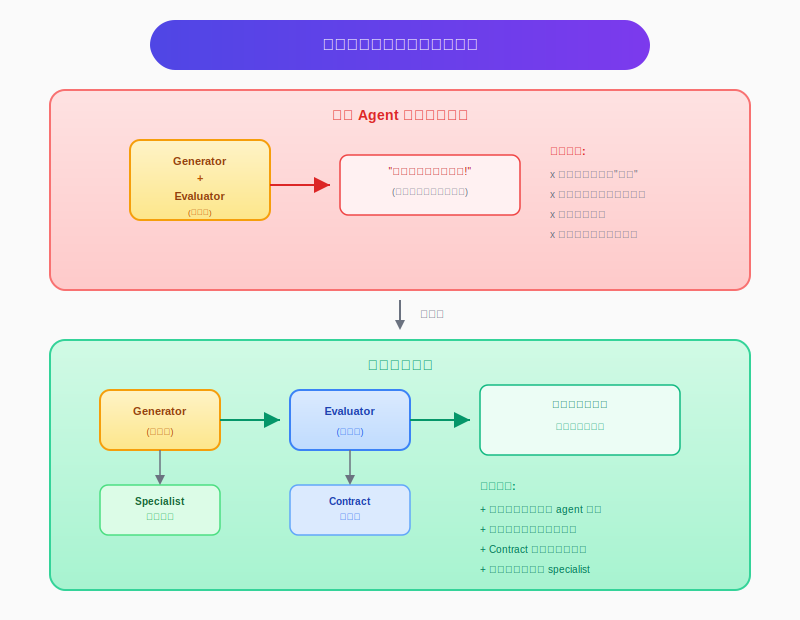
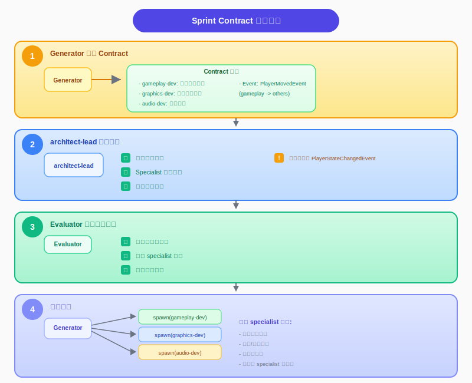
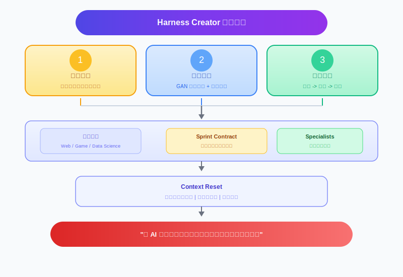
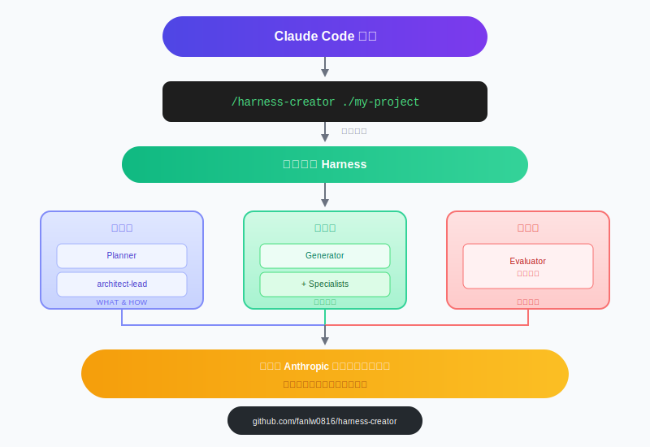

# Anthropic Harness 架构实战：一键部署到你的 Claude Code 项目

> GAN 启发的多智能体协作 + 领域专家系统，让 AI 不再"自欺欺人"

---

## 一句话介绍

**harness-creator** 是一个 Claude Code skill，**一条命令**就能为你的项目生成完整的 `.claude/` harness 框架，包含 Anthropic 官方推荐的多智能体协作架构 + 可定制的领域专家系统。

---

## 核心架构图

### Fusion Architecture：GAN 启发 + 领域专家


### 核心价值：为什么需要分离？



---

## 一条命令，生成什么？

### 安装

```bash
npx skills add https://github.com/fanlw0816/harness-creator --skill harness-creator
```

### 使用

```
/harness-creator ./my-project
```

### 游戏项目示例

```
检测到项目类型：Game Development (Unity)

推荐的配置:

核心 Agents (固定):
  Planner        - 产品规划
  Generator      - 协调执行
  Evaluator      - 评估实现
  architect-lead - 架构决策

Specialists:
  [√] gameplay-dev    游戏逻辑、机制、AI
  [√] graphics-dev    渲染、shader、特效
  [√] audio-dev       音效、音乐系统
  [ ] physics-dev     物理模拟、碰撞检测
  [√] ui-dev          游戏 UI、HUD、菜单

操作:
  A) 直接使用推荐
  B) 调整选择
  C) 添加自定义 specialist

你的选择：_
```

### 生成的结构

```
my-game-project/
│
├── .claude/                          # 🎯 一键生成的 harness 框架
│   │
│   ├── agents/                       # 🤖 智能体
│   │   ├── planner.md               #   规划者
│   │   ├── generator.md             #   协调者 (+ Agent 工具)
│   │   ├── evaluator.md             #   评估者
│   │   ├── architect-lead.md        #   架构师
│   │   ├── gameplay-dev.md          #   游戏逻辑专家
│   │   ├── graphics-dev.md          #   渲染专家
│   │   ├── audio-dev.md             #   音频专家
│   │   └── ui-dev.md                #   UI 专家
│   │
│   ├── skills/                       # 🔧 工作流技能
│   ├── hooks/                        # 🛡️ 自动验证
│   ├── rules/                        # 📏 编码规范
│   └── evaluation/                   # 📊 评估标准
│
└── CLAUDE.md                         # 📝 项目配置
```

---

## 领域模板系统

### 预定义模板

| 领域 | Specialists |
|------|-------------|
| **Web Development** | frontend-dev, api-dev, database-dev, devops-dev |
| **Game Development** | gameplay-dev, graphics-dev, audio-dev, ui-dev |
| **Data Science** | data-engineer, ml-engineer, data-analyst |
| **Mobile App** | ios-dev, android-dev, backend-dev |

### 动态生成

对于未预定义的领域，系统会：
1. 分析项目结构
2. 推断需要的 specialists
3. 动态生成 specialist 定义

```
你：我要为一个嵌入式项目生成 harness
系统：检测到新领域，推荐以下 specialists:
      [√] firmware-dev    固件开发
      [√] hardware-dev    硬件抽象层
      [ ] driver-dev      驱动开发
      
      确认使用？(Y/n)
```

---

## Specialist 定义

每个 specialist 有明确的领域边界：

```yaml
# gameplay-dev 示例

name: gameplay-dev
description: "游戏逻辑、机制、AI 专家"

# 领域边界
domain_scope:
  directories:
    - "Scripts/Gameplay/"
    - "Scripts/AI/"
  files:
    - "*.cs"
    - "*.gd"

# 职责
responsibilities:
  - 实现游戏机制
  - 创建状态机
  - 实现 AI 行为

# 反模式
anti_patterns:
  - "不要在 gameplay 脚本中写渲染代码"
  - "不要硬编码魔法数字"

# 与其他 specialist 的边界
boundaries:
  - with: graphics-dev
    rule: "gameplay 触发事件，graphics 处理视觉效果"
```

---

## Sprint Contract：三方协商

### Contract 协商流程



---

## 核心价值总结



### 实际效果对比

| 场景 | 传统 AI 编程 | 融合架构 Harness |
|:----:|:------------:|:----------------:|
| **复杂项目** | 😵 一个 agent 干所有<br/>领域知识不足 | 😊 专家分工协作<br/>各司其职 |
| **功能完整性** | 😵 经常遗漏边缘情况 | 😊 Contract 明确规定<br/>Evaluator 检查 |
| **架构一致性** | 😕 各部分风格不一 | 😊 architect-lead 审核<br/>统一架构决策 |
| **问题定位** | 😤 不知道哪里出错 | 😊 Contract 责任矩阵<br/>直接定位 specialist |

---

## 参考资料

- [Anthropic: Harness Design for Long-Running Apps](https://www.anthropic.com/engineering/harness-design-long-running-apps) - 核心思想来源
- [GitHub: harness-creator](https://github.com/fanlw0816/harness-creator) - 开源项目地址

---

## 总结

**Claude Code 的正确打开方式：**



---

**有帮助？点赞收藏，GitHub Star ⭐**

**有问题？评论区讨论！**
